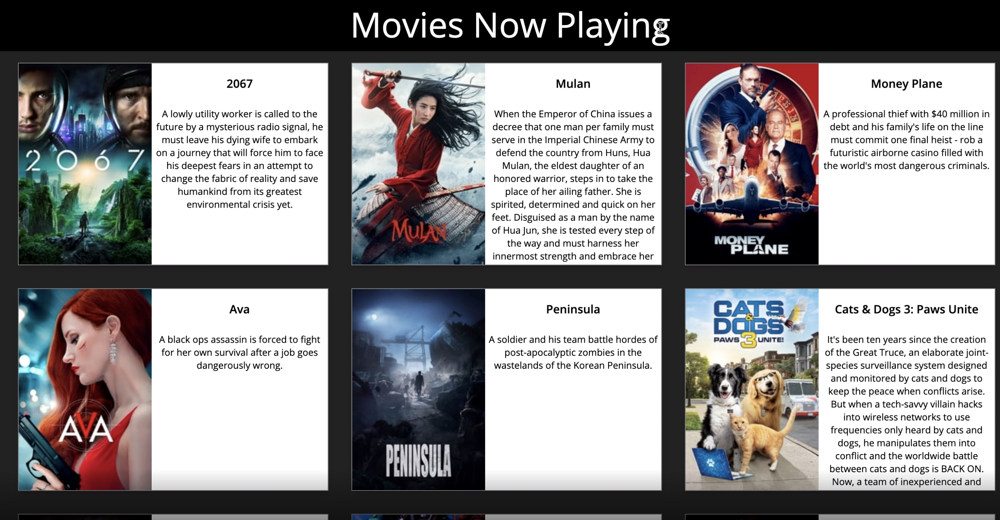

- Sign up for an api key at https://www.themoviedb.org/.  
- Create a project called ejs-movies.  
- Using router create a route /movies in a movieRoutes file.  
- Using axios movies should call the nowplaying endpoint and output using ejs.   
  the movies now playing in the format on the video using your css.  
Use partials as well:  
Head  
Header ---movie header should say Movies Now Playing  
Footer  
Output:  
---output movie poster, movie name and overview of the movie  
Refer to the video to see how the output should look. (edited)

https://www.themoviedb.org/